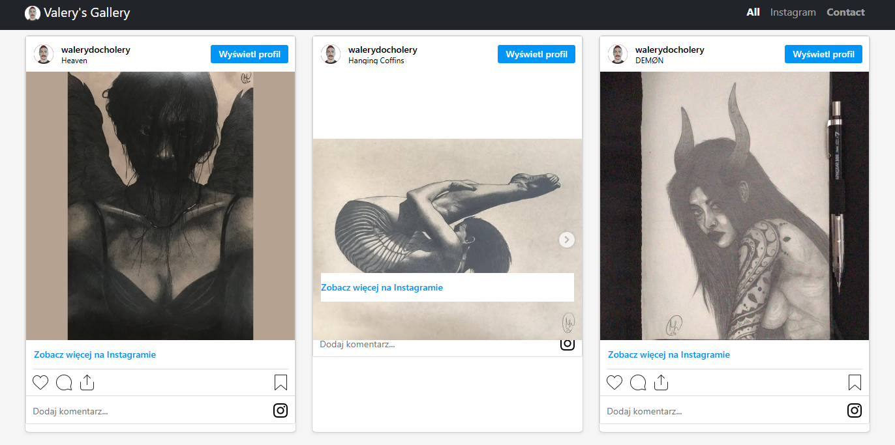

# 🎨 Valery's Gallery

A Django-powered portfolio app for showcasing artwork online.
Organize your images into categories, sync new Instagram posts automatically, browse in style, and let visitors reach out via contact form. Clean, responsive, and easy to manage.

[Visit Valery's Gallery](https://walery.pythonanywhere.com/)



## ✨ Features

- **Image Gallery**
  - Organize images into categories.
  - Display images with descriptions and modal views.
  
- **Instagram Integration**
  - Embed Instagram posts into the gallery based on categories.

- **Admin Features**
  - Upload and delete images.
  - Create and manage categories.

- **Contact Form**
  - Allows users to send messages.
  - Sends email notifications for new messages.

- **Responsive Design**
  - Optimized for desktop and mobile views.

---

## ⚡ Installation

### Requirements

- Python 3.10+
- Django 5.0+
- SQLite (default) or PostgreSQL/MySQL for production
- `python-dotenv` for environment variable management
- Requests library for API communication

---

### Step-by-Step Guide

1. **Clone the repository**:

   ```bash
   git clone https://github.com/draprar/django-gallery-valerys.git
   cd valery-gallery
   ```
2. **Install dependencies**:

Ensure pip is installed and run:

   ```bash
    pip install -r requirements.txt
   ```

3. **Set up environment variables**:

Create a .env file in the project root directory and add the following:

   ```bash
    SECRET_KEY=your-secret-key
    DEBUG=True
    ALLOWED_HOSTS=localhost,127.0.0.1
    EMAIL_HOST=smtp.your-email-provider.com
    EMAIL_PORT=587
    EMAIL_USE_TLS=True
    EMAIL_HOST_USER=your-email@example.com
    EMAIL_HOST_PASSWORD=your-email-password
    DEFAULT_FROM_EMAIL=your-email@example.com
    INSTAGRAM_ACCESS_TOKEN=your-instagram-access-token
   ```

4. **Make migrations**:

Run the following commands to set up the database:
   ```bash
   python manage.py makemigrations
   ```
   ```bash
   python manage.py migrate
   ```

5. **Create a superuser**:

   ```bash
   python manage.py createsuperuser
   ```

6. **Run the development server**:

Start the Django development server:

   ```bash
    python manage.py runserver
   ```

7. **Access the application**:

- Main page: http://127.0.0.1:8000/
- Admin panel: http://127.0.0.1:8000/admin/

## 📜 License

This project is licensed under the MIT License.

Developed by Walery ([@draprar](https://github.com/draprar/)).
