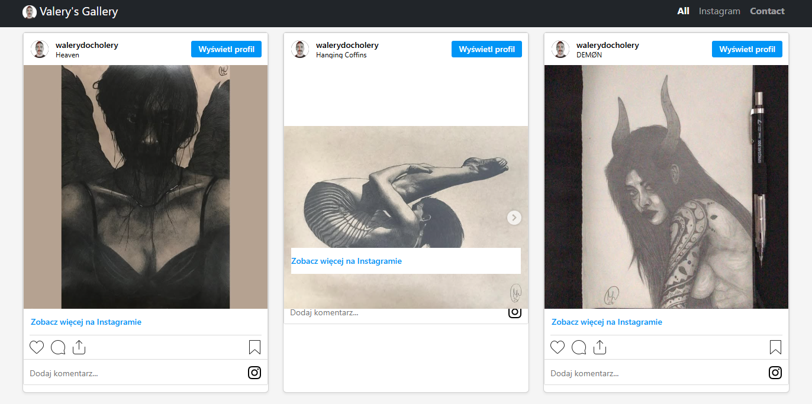

   
# 🎨 Valery's Gallery — Django App (Archived)

A Django-powered portfolio app for showcasing artwork online.
Organize images into categories, sync Instagram posts automatically, browse in style, and let visitors reach out via contact form. Clean, responsive, and easy to manage.

> ⚠️ This repository is archived.  
> This project has been integrated into my main portfolio:  
> https://github.com/draprar/django_portfolio-walery (see `/gallery` app)

> 🌐 Live version: https://walery.site/gallery/



## 📖 Overview

This project is a Django-based gallery app created for showcasing artwork and visual content in a structured, responsive layout.

It started as a standalone application and was later integrated into a larger modular portfolio system.

## 🧠 Project Evolution

- Standalone Django gallery application
- Integrated into the portfolio project as a module
- Archived for historical reference
  
## ✨ Features

- **Image Gallery**
  - Organize images into categories
  - Display images with descriptions and modal views
- **Instagram Integration**
  - Embed Instagram posts into the gallery based on categories
- **Admin Features**
  - Upload and delete images
  - Create and manage categories
- **Contact Form**
  - Allows users to send messages
  - Sends email notifications for new messages
- **Responsive Design**
  - Optimized for desktop and mobile views

## 🚀 Installation

### Requirements

- Python 3.10+
- Django 5.0+
- SQLite (default) or PostgreSQL/MySQL for production
- `python-dotenv` for environment variable management
- Requests library for API communication

### Step-by-Step Guide

1. **Clone the repository**:
```
   git clone https://github.com/draprar/django-gallery-valerys.git
   cd valery-gallery
```

2. **Create and activate a virtual environment**:
```
   python -m venv venv
   source venv/bin/activate   # Windows: venv\Scripts\activate
```

3. **Install dependencies**:
```
    pip install -r requirements.txt
```

4. **Set up environment variables**:
Create a `.env` file in the project root directory and add the following:
```
   SECRET_KEY=your-secret-key
   DEBUG=True
   ALLOWED_HOSTS=localhost,127.0.0.1
   EMAIL_HOST=smtp.your-email-provider.com
   EMAIL_PORT=587
   EMAIL_USE_TLS=True
   EMAIL_HOST_USER=your-email@example.com
   EMAIL_HOST_PASSWORD=your-email-password
   DEFAULT_FROM_EMAIL=your-email@example.com
   INSTAGRAM_ACCESS_TOKEN=your-instagram-access-token
```

5. **Apply migrations**:
```
   python manage.py makemigrations
   python manage.py migrate
```

6. **Create a superuser**:
```
   python manage.py createsuperuser
```

7. **Run the development server**:
```
   python manage.py runserver
```

8. **Access the application**:
   - Main page: http://127.0.0.1:8000/
   - Admin panel: http://127.0.0.1:8000/admin/

## 📜 License

This project is licensed under the MIT License.

## 👤 Author

Developed by Walery ([@draprar](https://github.com/draprar/)).
